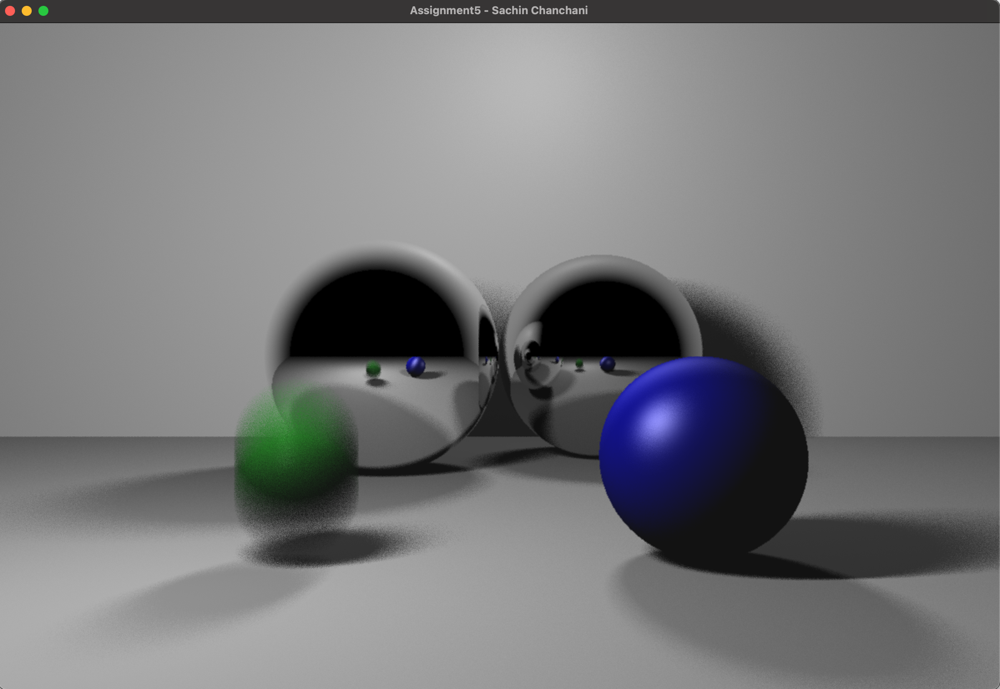

# Ray tracing from scratch

Built this as part of an assignment for a computer graphics course - the default scene demonstrates the features (reflection, anti-aliasing, motion blur, soft shadows, etc.) but arbitrary triangle meshes stored in wavefront (.obj) format can also be rendered. 



### Requirements
* GLEW-2.1.0
* GLFW-3.3.8
* GLM 

### Usage 
```bash
# in working directory with glfw/glew/glm in parent directory
mkdir build
cd build
cmake ..
# compile and run
make -j4
./Assignment5
```

## Citations

```bibtex
@book{marschner2018fundamentals,
  title={Fundamentals of Computer Graphics},
  author={Marschner, S. and Shirley, P.},
  isbn={9781315360201},
  url={https://books.google.com/books?id=9H10DwAAQBAJ},
  year={2018},
  publisher={CRC Press}
}
```
